# [Silk Road Travels](https://github.com/Lobarab/html-project) 

# Introduction

Silk Road Travels is a travel agency that specializes in booking trips to Uzbekistan. Since the country is located at the heart of the Great Silk Road, the name of the agency is inspired by this ancient trade route.
The users can browse the pages and learn about the country and its main ancient cities and send enquiries for booking trips 

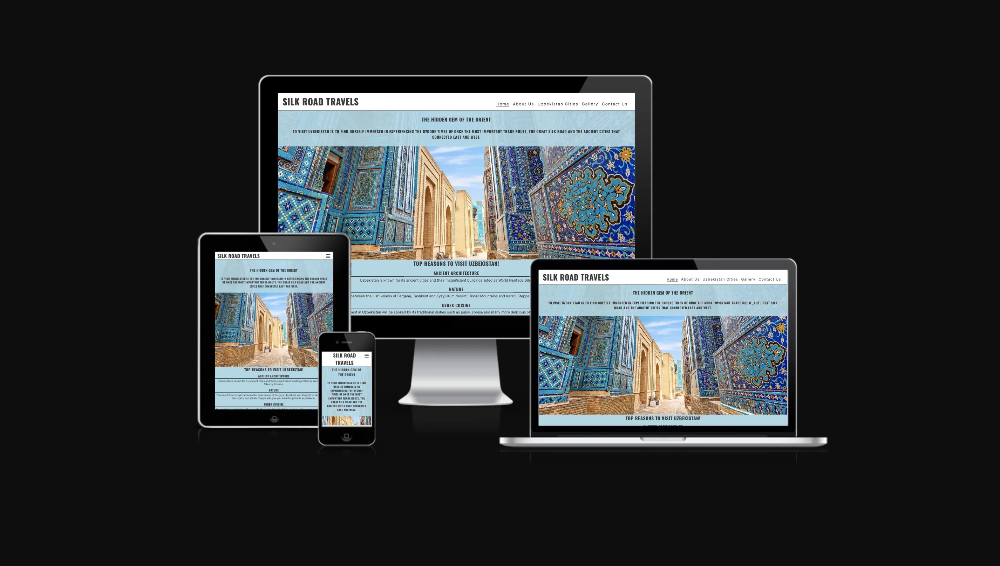

## Structure

The website consists of 5 pages including Home, About Us, Uzbekistan Cities, Gallery and Contact Us pages.It is created only by using HTML/CSS. index.html was created first and its structure was copied to create other pages and then invidual changes applied to each page

### HTML/CSS

The HTML structcture of the website consists of index.html, aboutus.html, uzbekistancities.html, gallery.html and contactus.html.
Styling and images are  added/ applied with style.css (css folder) and images folder. 

## Features

### Favicon
Bactrian camel image has been used as a favicon as it is one of the symbols of Silk Road.
### Header
- Header is located at the top of the each page in a white background and contains the name of the agency **Silk Road Travels** in the top left corner and Navigation at the top right corner.
- it has colour contrast with white background and a black font. Header appears above the main element in each page.

### Navigation

- Navigation is located at the top right corner of the Home page and displays all the other pages of the website such as Home, About Us, Uzbekistan Cities, Gallery and Contact Us.
- It appears as **hamburger menu** on tablet and mobile screens and when clicked displays all the available pages.
- Navigation links are interactive: each one with an underline on hover and it is present in each page.
- Navigation bar is fully responsive to the screen size of different devices.

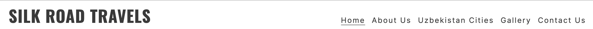

### Home
Alongside with Header, Main and Footer,the Home page has the following features:

- **hero image** with a text introduction of Uzbekistan on the upper part of the hero image. The image used shows the vibrant colours of an ancient archtectural complex. 

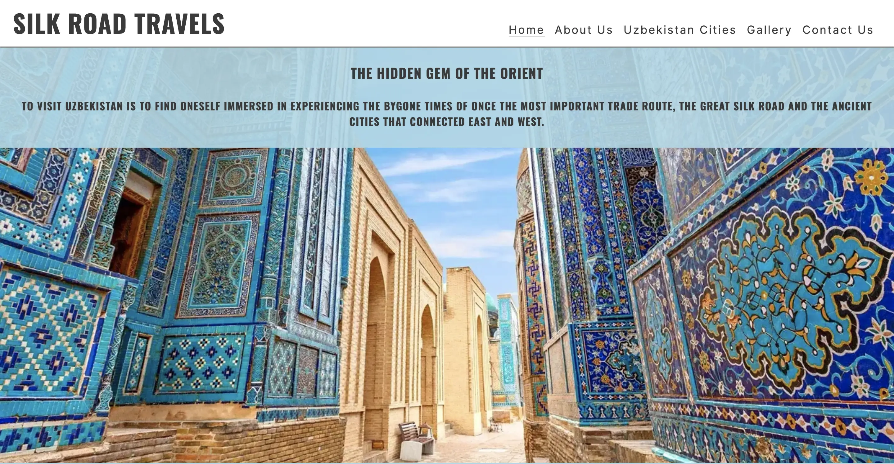

**Top Reasons to Visit Uzbekistan**
 Top reasons section  in a blue background is located below hero image and highlights four points each with an explanation followed by the image of a girl in a traditional attire holding a pomegranate.
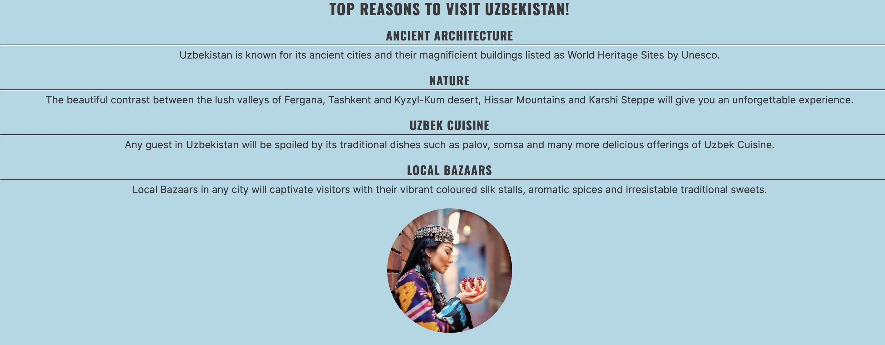

### Footer

The Footer section appears at the bottom of every page of the website. Its background colour is white and social media icons appear in black.

### About Us 

About Us page is a small introduction of the travel agency and what they do.
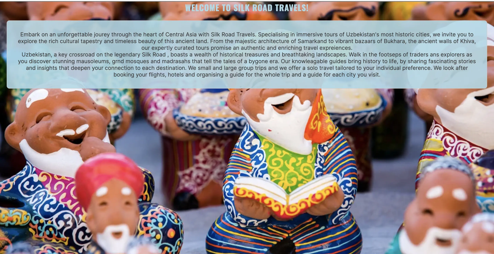

### Uzbekistan Cities
Uzbekistan Cities page gives a brief information about:
- The history of the major historical cities such as Tashkent, Samarkand, bukhara and Khiva.
- Highlights the must go historical areas and buildings within each city. 
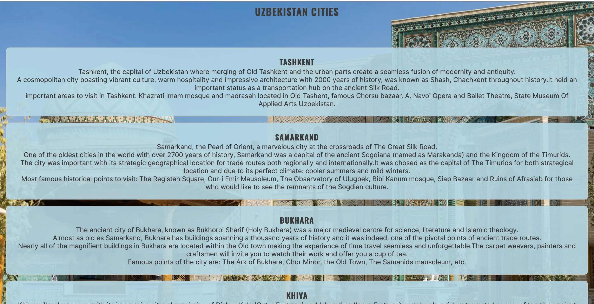

### Gallery
- The Gallery page gives a glimpse to the stunning architecture, vibrant colours, food and spices.
Please note images are taken from various sources and this website does not claim to own the images. 
- The gallery is responsive to all screen sizes.
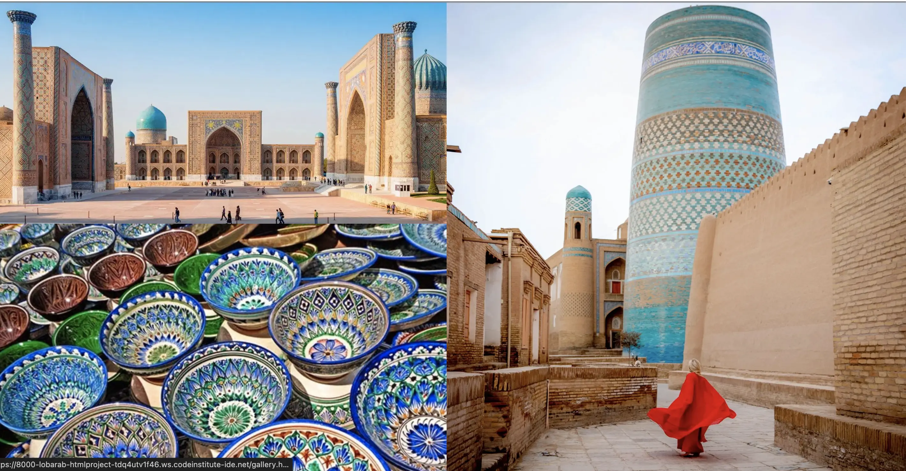

### Contact Us
- Contact Us page consists of a background image of the mountains with Bactrian Camel and has a form with a lightblue translucent colour set by rgb value in css. 
- The form has mandatory fields and encourages the the viewer to submit their name, last name, email address and it has a message section. 
- It gives the viewer *Group Travel* and *Solo Travel* options to choose from and  notifies the travel agency about the preferred kind of trip of the user. Code Institute webpage has been used to check the functionality of the form. the page adjusts to various screen types
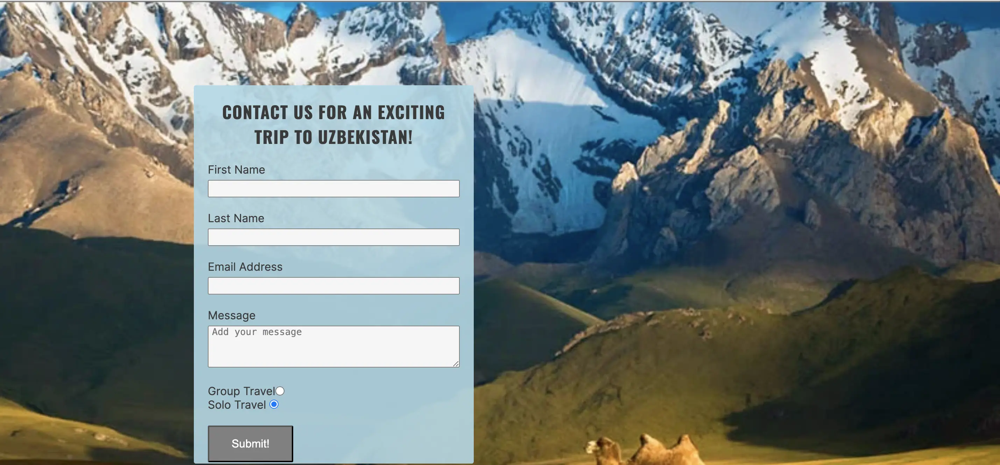

## Testing.

- The testing of the website has been done on all browsers including  Chrome, Firefox and Safari.
- I have tested and confirmed that the website is responsive to different device screens.
- All fields in Contact Us form are mandatory and requires only and email in Email Address field.

## Bugs
*Solved Bugs*

- The top of the Main element kept hiding behind the header and nav in tablet screen size and it was solved by adjusting the pixels for the relevant device and changing the margins in media queries.
- The form in **Contact Us** page was overflowing above the footer in desktope screen. It was solved by adding padding-bottom property with 100px value to #contactus in media queries for larger screens.

## Validator Testing

- HTML:
No Errors were found when using W3C HTML validator.

- CSS: No errors were detected within the CSS iself by W3C validator except it highligting the following for the imported fonts: *"Imported style sheets are not checked in direct input and file upload modes."*

- Accessibility: The colors and and fonts accessibilty were checked by using Lighthouse in DevTools.
Following are the Acessibility assessment images for each page of the website.Please note that Accessibilty score is higher on desktop screens.

*Home*
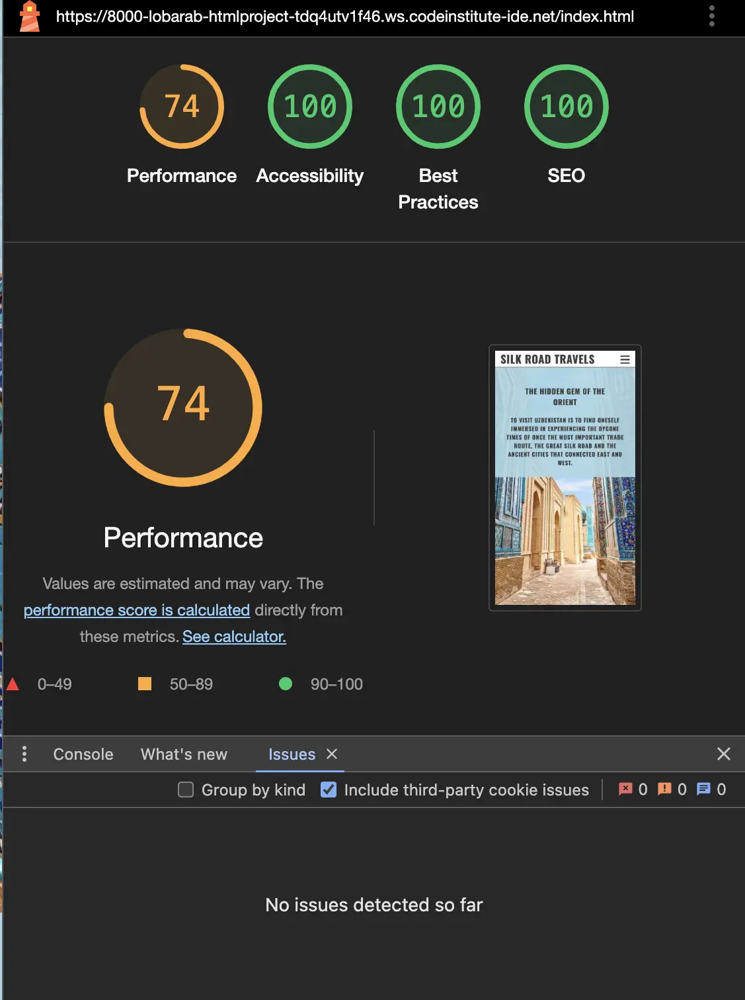

*About Us*
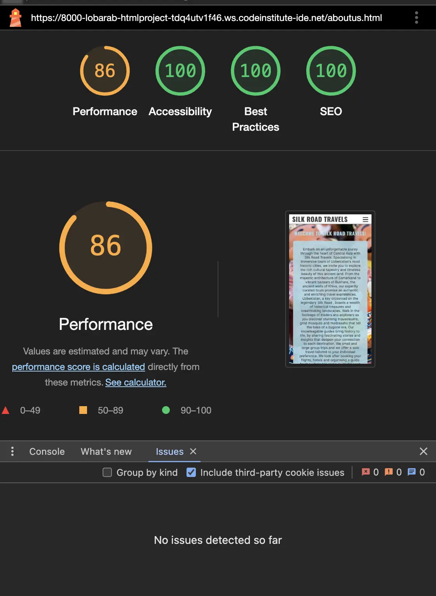

*Uzbekistan Cities*
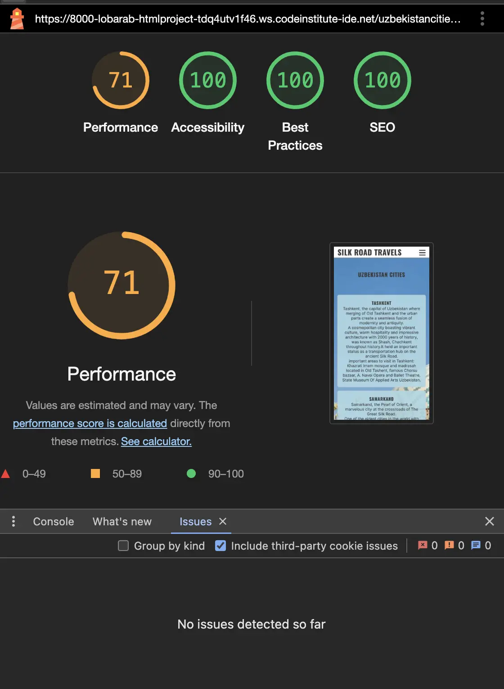

*Gallery*
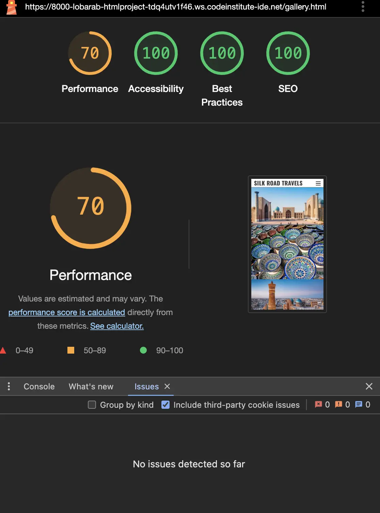

*Contact Us*
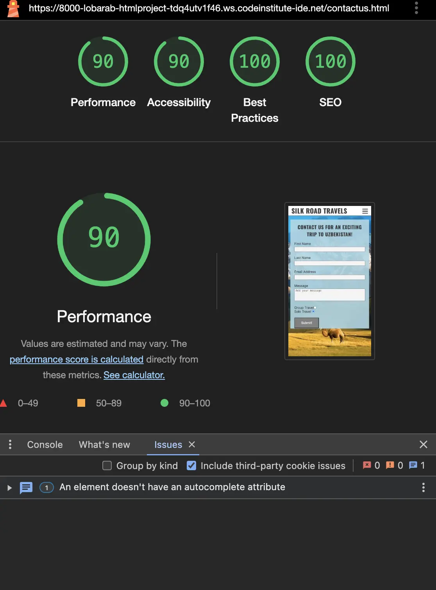

### Unfixed bugs.
No unfixed bugs detected.

## Deployment

The project was deployed in GitHub as following:
- By going to Settings in GitHub and choosing Pages via Code and Automation.
- By selecting set To Main branch and Folder set to /(root).
- it was ready in Environments section as clickable "github-pages."

Live link: [Silk Road Travels](https://lobarab.github.io/html-project/)

## Credits

**Content:** 
- The code structure such as Header and Footer were taken from [Love Running](https://lobarab-loverunning-ysbilvq9qci.ws.codeinstitute-ide.net/) project.

### Media.

- The images were taken from various internet sources. 